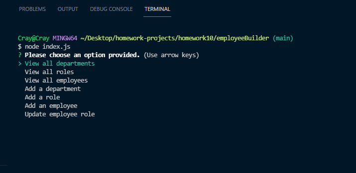

# Employee Builder

#

### **Description:**

Developers frequently have to create interfaces that allow non-developers to easily view and interact with information stored in databases. These interfaces are called  **content management systems (CMS)** .   Our  [_Employee Builder_](https://github.com/SmithCray/employeeBuilder) is designed to do just that, by using our simple and easy command-line application using  _Node.js_, _Inquirer_,  and  _MySQL_ . Our goal is to provide the ability to view and manage a set of departments, roles, and employees in a given company and organize the return as well as visualize thier buisness.

### **Install and Usage**

#

 **Needed Dependancies;** 

- [MySQL2 package](https://www.npmjs.com/package/mysql2)

- [Inquirer package](https://www.npmjs.com/package/inquirer)

- [console.table package](https://www.npmjs.com/package/console.table)

 **Installation;** 

1. npm i mysql2

2. npm i inquirer

3. npm i console.table

 **Console Command;** 

1. node index.js

 

### Preview:

#

### **Links**

#

Video Example:
 
https://drive.google.com/file/d/1Rd13tl69zaYJhLWcnccYbXrFBD3qWyeD/view

GitHub repo:
 
https://github.com/SmithCray/employeeBuilder

Git Profile:
 
https://github.com/SmithCray

 

##  Copyright (c) [2021]   [Cray Smith] 

Permission is hereby granted, free of charge, to any person obtaining a copy
of this software and associated documentation files (the "Software"), to deal
in the Software without restriction, including without limitation the rights
to use, copy, modify, merge, publish, distribute, sublicense, and/or sell
copies of the Software, and to permit persons to whom the Software is
furnished to do so, subject to the following conditions:

The above copyright notice and this permission notice shall be included in all
copies or substantial portions of the Software.

THE SOFTWARE IS PROVIDED "AS IS", WITHOUT WARRANTY OF ANY KIND, EXPRESS OR
IMPLIED, INCLUDING BUT NOT LIMITED TO THE WARRANTIES OF MERCHANTABILITY,
FITNESS FOR A PARTICULAR PURPOSE AND NONINFRINGEMENT. IN NO EVENT SHALL THE
AUTHORS OR COPYRIGHT HOLDERS BE LIABLE FOR ANY CLAIM, DAMAGES OR OTHER
LIABILITY, WHETHER IN AN ACTION OF CONTRACT, TORT OR OTHERWISE, ARISING FROM,
OUT OF OR IN CONNECTION WITH THE SOFTWARE OR THE USE OR OTHER DEALINGS IN THE
SOFTWARE.
